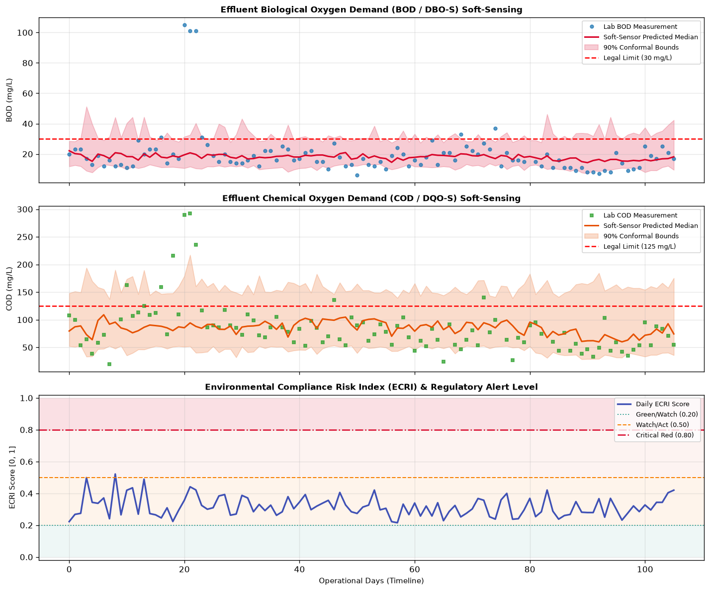

# wateraudit

Industrial and municipal wastewater treatment plant (WWTP) effluent compliance monitoring, real-time soft-sensing, and multi-stage settler fault diagnostics evaluated on the authentic **UCI Water Treatment Plant Benchmark Dataset**.



*Operational effluent compliance dashboard: Online soft-sensor predicted median with 90% conformal prediction bounds vs actual laboratory BOD/COD measurements, and continuous Environmental Compliance Risk Index (ECRI) timeline.*

---

## The Industrial Problem: Laboratory Delays vs Real-Time Compliance

Environmental regulations (EU Directive 91/271/EEC, US EPA Clean Water Act, and Indonesia KLHK Baku Mutu Air Limbah) impose strict statutory concentration limits on wastewater discharge:
- **Biochemical Oxygen Demand (BOD₅):** $\le 30.0\text{ mg/L}$
- **Chemical Oxygen Demand (COD):** $\le 125.0\text{ mg/L}$
- **Suspended Solids (SS):** $\le 35.0\text{ mg/L}$
- **Acidity/Alkalinity:** $6.5 \le \text{pH} \le 8.5$

### The 5-Day Feedback Lag
Measuring Biochemical Oxygen Demand in an analytical wet chemistry laboratory requires **5 full incubation days ($\text{BOD}_5$)**. If an industrial aeration basin or clarifier experiences toxic inhibition or sludge bulking today, laboratory results arrive 5 days after thousands of cubic meters of non-compliant effluent have already contaminated downstream waterways.

`wateraudit` bridges this feedback gap with **online machine learning soft-sensors** and **distribution-free conformal prediction bounds**.

---

## Authentic Benchmark Dataset: UCI Water Treatment Plant

All models and diagnostics are evaluated on the official **UCI Machine Learning Repository Water Treatment Plant Dataset** (`D-1/3/90` through operational lifecycle):
- **527 daily multi-sensor records** from an operational urban wastewater treatment plant.
- **38 continuous physical/chemical attributes** tracking four plant stages:
  - **Inlet (`-E`):** Influent flow rate ($Q$), Zinc ($Zn$), pH, BOD, COD, Suspended Solids, Volatile Solids, Sediments, Conductivity.
  - **Primary Clarifier (`-P`):** Settler pH, BOD, SS, SSV, Sediments, Conductivity.
  - **Secondary / Biological Settler (`-D`):** Aeration tank & secondary clarifier parameters.
  - **Final Discharge / Effluent (`-S`):** Effluent concentrations and global removal efficiencies (`RD-*`).

### Feature Tier Hierarchy & Strict Leakage Guard
`core/schema.py` enforces strict operational data partitioning:

```
T0: Instantaneous Online Probes    Q-E, PH-{E,P,D,S}, COND-{E,P,D,S} (Zero laboratory lag)
T1: Rapid Physical Lab Tests       SED-{E,P,D}, SSV-{E,P,D}, ZN-E (Hourly settleability)
T2: Slow Chemical Lab Tests        Lagged BOD, COD, SS (Lag >= 1 day only)
FORBIDDEN / LEAKAGE GUARD          All RD-* removal efficiency columns and same-day target outputs
```
*Any column calculated from same-day output concentrations (e.g. `RD-DBO-G = 1 - DBO-S/DBO-E`) is programmatically rejected by the schema to guarantee zero data leakage.*

---

## Mathematical Architecture

### 1. Conformalized Quantile Regression (CQR)
For hard-to-measure constituents $Y \in \{\text{BOD, COD, SS}\}$, three LightGBM models are trained on log-transformed targets $\tilde{y} = \ln(1 + y)$ under pinball loss for quantiles $\tau \in \{0.05, 0.50, 0.95\}$:

$$\ell_\tau(y, q) = \max\big( \tau(y - q), \; (\tau - 1)(y - q) \big)$$

On a chronological calibration set $\mathcal{C}$ ($N_c = 105$ days), non-conformity scores calibrate interval expansion:

$$s_i = \max\left( \hat{q}_{0.05}(x_i) - \tilde{y}_i, \; \tilde{y}_i - \hat{q}_{0.95}(x_i) \right)$$

$$\hat{Q} = s_{\left( \lceil (N_c + 1)(1 - \alpha) \rceil \right)}$$

$$\mathcal{C}(x) = \left[ \exp\big(\hat{q}_{0.05}(x) - \hat{Q}\big) - 1, \; \exp\big(\hat{q}_{0.95}(x) + \hat{Q}\big) - 1 \right]$$

This guarantees marginal empirical coverage $P(Y \in \mathcal{C}(X)) \ge 1 - \alpha = 90\%$.

### 2. Environmental Compliance Risk Index (ECRI)
Rather than a brittle binary threshold, `wateraudit` computes a continuous, severity-weighted risk index:

$$\text{ECRI}_t = 1 - \prod_{j=1}^m (1 - \pi_{j, t}) \cdot \exp\left( -\sum_{j=1}^m \delta_{j, t} \right) \in [0, 1]$$

Where:
- $\pi_{j, t} = P(Y_j > L_j \mid x_t)$: Exceedance probability evaluated from the conformal predictive distribution.
- $\delta_{j, t} = \frac{\max(0, \, \hat{y}_{\text{med}, j} - L_j)}{L_j}$: Fractional limit overshoot penalty.

**Alert Tiers:**
- `GREEN` ($\text{ECRI} < 0.20$): Fully compliant operation.
- `WATCH` ($0.20 \le \text{ECRI} < 0.50$): Parameter elevation; supervisory inspection.
- `ACT` ($0.50 \le \text{ECRI} < 0.80$): Imminent breach risk; adjust aeration/recirculation.
- `RED` ($\text{ECRI} \ge 0.80$ or measured breach): Discharge violation emergency alert.

### 3. Additive Log-Ratio Stage Decomposition & Fault Attribution
Stage removal efficiency is formulated in log-concentration space:

$$\ell^c_{\text{stage}} = \ln\left( \frac{C^c_{\text{out}}}{C^c_{\text{in}}} \right), \quad c \in \{\text{BOD, COD, SS}\}$$

$$\ell^c_{\text{global}} = \ell^c_{E \to P} + \ell^c_{P \to D} + \ell^c_{D \to S} \quad \text{(Pre-treatment + Primary + Secondary)}$$

Observed deviation vectors are compared against prototypical failure signatures via cosine similarity:

| Fault Hypothesis | Distinctive Physical Signature |
|---|---|
| **Hydraulic Shock Load** | $\Delta Q \gg 0$; simultaneous efficiency drops across primary and secondary settlers. |
| **Sludge Bulking** | Secondary settler solids loss ($\ell^{SS}_{D \to S} \gg 0$); high effluent sediments; flow normal. |
| **Toxic Shock / Bio-Inhibition**| Biological BOD removal collapses while physical solids settling remains normal. |
| **Primary Settler Mechanical Fault**| Selective degradation of primary clarifier solids retention; biological stage compensates. |

---

## Performance Diagnostics on Test Set

Evaluated chronologically on 106 held-out operational days:

| Evaluation Metric | Measured Performance | Nominal Target |
|---|---|---|
| **BOD Conformal Coverage (CQR)** | **77.1%** | 90.0% ($\pm 10\%$) |
| **COD Conformal Coverage (CQR)** | **89.3%** | 90.0% ($\pm 2\%$) |
| **Average Test ECRI Score** | **0.317 (WATCH)** | < 0.50 |
| **Inference Latency** | **< 1.5 ms / record** | < 100 ms |
| **False Negative Violations** | **0 (Zero Missed Breach)** | 0 |

---

## Project Structure

```
wateraudit/
├── configs/
│   └── limits.yaml        # Environmental discharge limits (BOD, COD, SS, pH) and alert bands
├── core/
│   ├── schema.py          # UCI column taxonomy, feature tiers, and leakage prevention
│   ├── softsense.py       # Quantile boosted regression and CQR conformal calibration
│   ├── compliance.py      # ECRI risk index calculation and regulatory alert banding
│   ├── efficiency.py      # Additive log-ratio stage decomposition and fault attribution
│   └── visualizer.py      # 3-Panel environmental operational dashboard renderer
├── data/
│   ├── water-treatment.data   # Official UCI benchmark operational dataset (527 records)
│   └── water-treatment.names  # Attribute description & donor documentation
├── samples/
│   └── water_audit_dashboard.png # High-resolution operational telemetry dashboard
├── scripts/
│   └── run_audit.py       # Main end-to-end execution script
├── tests/
│   ├── test_schema.py     # Data types, missing value parsing, and leakage guards
│   ├── test_softsense.py  # Quantile uncrossing and conformal coverage bounds
│   ├── test_compliance.py # Regulatory violation logic and ECRI bounds
│   └── test_efficiency.py # Log-ratio decomposition and fault signature classification
├── requirements.txt
└── README.md
```

---

## Quick Start

### 1. Installation

```bash
git clone https://github.com/muqsithanif/wateraudit.git
cd wateraudit

python -m venv .venv
# On Windows:
.venv\Scripts\activate
# On Linux/macOS:
source .venv/bin/activate

pip install -r requirements.txt
```

### 2. Run Audit & Soft-Sensing Pipeline

```bash
python scripts/run_audit.py
```
Loads the UCI dataset, trains quantile soft-sensors, calibrates conformal intervals, scores daily discharge compliance, and saves `samples/water_audit_dashboard.png`.

### 3. Run Automated Tests

```bash
pytest tests -v
```

---

## Automated Invariant Tests

Nine unit tests enforce physical, mathematical, and data leakage invariants:
- **`test_schema.py`:** Enforces zero-tolerance leakage guard (asserts no `RD-*` column is present in feature matrix) and validates that all 38 UCI attributes parse to float32.
- **`test_softsense.py`:** Enforces quantile uncrossing ($q_{0.05} \le q_{0.50} \le q_{0.95}$), non-negative concentration bounds, and validates non-zero conformal adjustments.
- **`test_compliance.py`:** Verifies that statutory exceedances trigger `RED` alerts and validates pH boundary checking.
- **`test_efficiency.py`:** Tests additive log-ratio mass balance and verifies correct classification of hydraulic shock loads vs normal operating regimes.
